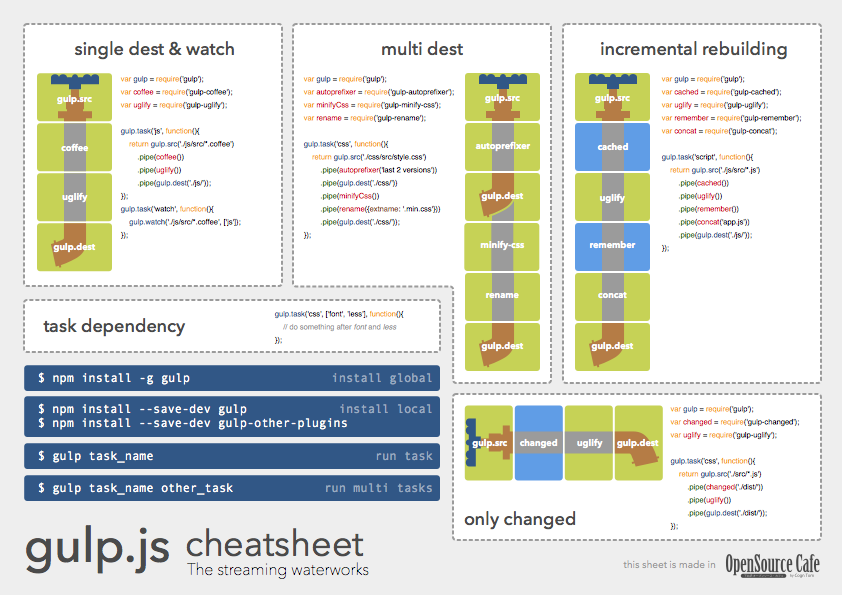
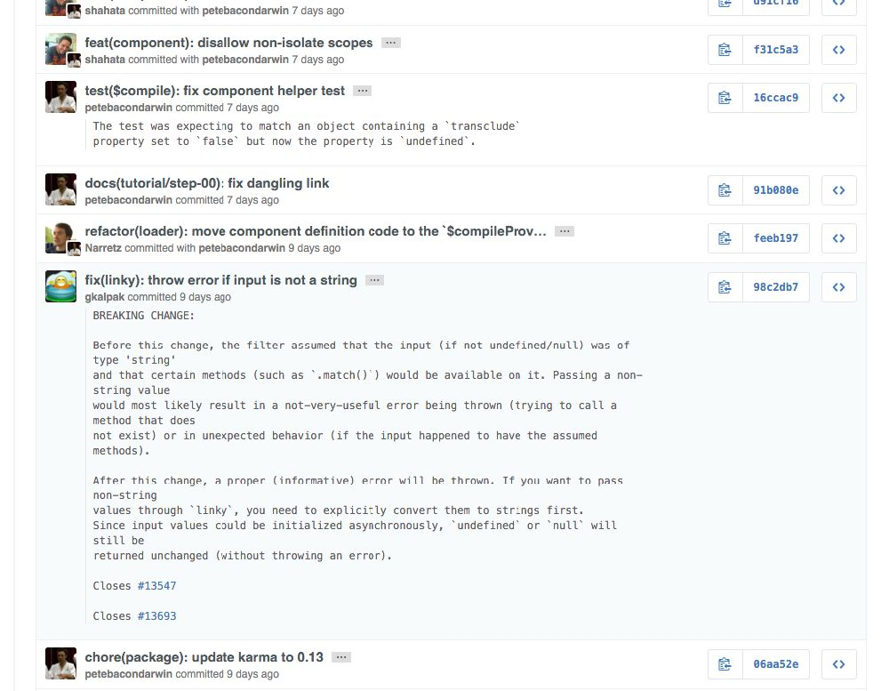

# 辅助

## Node.js Application Configuration

https://github.com/lorenwest/node-config

创建json配置

```
 $ vi config/production.json
```

内容

```
{
  "Customer": {
    "dbConfig": {
      "host": "prod-db-server"
    },
    "credit": {
      "initialDays": 30
    }
  }
}
```

Use configs in your code:

```
var config = require('config');
//...
var dbConfig = config.get('Customer.dbConfig');
db.connect(dbConfig, ...);

if (config.has('optionalFeature.detail')) {
  var detail = config.get('optionalFeature.detail');
  //...
}
```

## env

常见做法（express和koa都是这样做的）

```
var env = process.env.NODE_ENV || 'development';
```

env大致有4种可能

- 线上环境（Production）
- 开发环境（Development）
- 演示环境（Staging）
- 测试环境（Test）

## 利用env配置项目：nconf

https://github.com/indexzero/nconf


Using nconf is easy; it is designed to be a simple key-value store with support for both local and remote storage. Keys are namespaced and delimited by :. Let's dive right into sample usage:

```
  var fs    = require('fs'),
      nconf = require('nconf');

  //
  // Setup nconf to use (in-order):
  //   1. Command-line arguments
  //   2. Environment variables
  //   3. A file located at 'path/to/config.json'
  //
  nconf.argv()
   .env()
   .file({ file: 'path/to/config.json' });

  //
  // Set a few variables on `nconf`.
  //
  nconf.set('database:host', '127.0.0.1');
  nconf.set('database:port', 5984);

  //
  // Get the entire database object from nconf. This will output
  // { host: '127.0.0.1', port: 5984 }
  //
  console.log('foo: ' + nconf.get('foo'));
  console.log('NODE_ENV: ' + nconf.get('NODE_ENV'));
  console.log('database: ' + nconf.get('database'));

  //
  // Save the configuration object to disk
  //
  nconf.save(function (err) {
    fs.readFile('path/to/your/config.json', function (err, data) {
      console.dir(JSON.parse(data.toString()))
    });
  });
```

If you run the above script:

```
  $ NODE_ENV=production sample.js --foo bar
```

The output will be:

```
  foo: bar
  NODE_ENV: production
  database: { host: '127.0.0.1', port: 5984 }
```

## gulp

简单的讲，gulp是一个构建工具，一个streaming构建工具，一个nodejs写的构建工具

总之，它是一个构建工具

那么什么是构建工具呢？

构建工具本质就是为了自动化构建，解放程序员、提供程序员效率的工具

我们来举个例子，最早的make，因为每次都cc编译，太恶心了，而且当文件特别多的时候，编译速度又慢下来，能不能按需编译，增量编译？

make是通过makefile文件来描述源程序之间的相互关系并自动维护编译工作的

例子就不举了，写过c的人多少都知道点

其实编译在每个语言世界里，都是痛，骨子里的风湿一样，于是产生了make类似的东西

- 比如java里的ant，c#里的NAnt
- 比如ruby里rake
- 比如coffeescript里有cake

它们的共同特点

- 1)基于task，定义简单
- 2)task有串行，并行，作业依赖等控制方式
- 3)通过xxxfile来定义task

如此看来，nodejs的构建系统也应该是这样的，可以说gulp是node世界里和上面几个构建工具最像的一个，它们太像了，以至于学习起来特别简单

其实上面还提了一个streaming，是流式的意思，后面讲原理的时候会深入讲解

前端本身就对js非常了解，gulp可以说是plain 
js，语法都再简单不过，所以大家比较容易接受

### why gulp？
#### 1. 基于nodejs

基于nodejs的小而美哲学，写gulp task是件很愉快的事儿

而且还可以结合nodejs世界里最好的包管理器npm，写cli或者模块特别简单

而且可以写c/c++ addon，给你无限可能

而且还有shelljs这样的库，结合shell，给你无限可能

#### 2. 易于使用

通过代码优于配置的策略，Gulp 让简单的任务简单，复杂的任务可管理。

而且对ant，rake，make等了解的人非常容易上手

#### 3. 构建快速

利用 Node.js stream的威力，你可以快速构建项目并减少频繁的 IO 操作。

而且gulp的核心代码可以高效利用你所有核的cpu，高效运行，尤其是大文件处理，后面会讲到

####  4. 插件机制

Gulp 严格的插件指南确保插件如你期望的那样简洁高质得工作。

#### 5. 易于学习

通过最少的 API，掌握 Gulp 毫不费力

这得益于gulp的设计，api简单，调用关系和依赖清晰，当然如果理解linux 管道或者其他类似的构建工具会容易

而且每个任务都拆分成一个task，结构清晰，利用stream和pipe写法，组成task，也是非常容易学习的。

###  入门




说的还是相当清晰的，喜欢的自己学

另外仓库在此
https://github.com/osscafe/gulp-cheatsheet


另外一篇是

http://i5ting.github.io/stuq-gulp/

即stuq-gulp.md

说是入门指南，还是得从npm开始科普

#### 1. 安装 gulp：

建议全局安装

```sh
$ npm install --global gulp
```

但最多的是作为项目的开发依赖（devDependencies）安装：

```sh
$ npm install --save-dev gulp
```

#### 2. 创建gulpfile

在项目根目录下创建一个名为 `gulpfile.js` 的文件：

```js
var gulp = require('gulp');

gulp.task('default', function() {
  // 将你的默认的任务代码放在这
});
```

gulpfile和makefile、build.xml等是类似的，定义task的地方。

定义好task，下面运行一下

#### 3. 运行 gulp：

```sh
$ gulp
```

默认的名为 default 的任务（task）将会被运行，在这里，这个任务并未做任何事情。

想要单独执行特定的任务（task），请输入 `gulp <task> <othertask>`。
  
是不是很简单？

下面比较一下grunt和gulp

### 快速入门

都说得来个hello world

#### hello world

创建gulpfile.js

```
var gulp = require('gulp');

gulp.task('default', function() {
    console.log('hello world')
});

```

然后只需执行命令

```
gulp
```

定义作业就是这么加单

- default是名字
- 后面的匿名函数是它的实现

#### 自定义作业

custom task with name stuq

```
var gulp = require('gulp');

gulp.task('stuq', function() {
    console.log('hello stuQ!')
});

```

then run

```
gulp stuq
```

这里的stuq是作业名称

自己定义一个task就是这么简单

#### 依赖作业

```
gulp.task('default',['watch'],function() {
    console.log('default task');
});
```

这里的task有3个参数

default是方法名称，只有default比较奇怪，会默认调用。

相当于c里的main方法

['watch']这是依赖的作业列表，它们是由顺序的，按数组顺序依次执行
第三个参数是成功执行完上面的依赖作业后执行的回调函数

这里要强调，依赖作业数组里的都执行完了，才会执行第三个参数，即当前作业具体内容


我们不妨改一下，看看多个依赖如何定义

```
gulp.task('default',['watch','task_2','task_3'],function() {
    console.log('依赖作业终于执行完了，下面是我的舞台....');
});
```

是不是很简单？放心，这只是入门，下面看一下流式处理

#### 流式处理

比如混淆压缩js，使用gulp-uglify插件

```
var gulp = require('gulp');
var uglify = require('gulp-uglify');

gulp.task('default', function() {
    gulp.src('src/*.js')
        .pipe(uglify())   //压缩js
        .pipe(gulp.dest('dist'))
});
```

- src是输入
- dest是输出


pipe是管道的意思，也是stream里核心概念，也就是说：上一个的输出，是下一个的输入。

src里所有js，经过处理1，处理2，然后压缩变成min.js,中间的处理pipe可以1步，也可以是n步

反正第一步处理的结果是第二步的输入，以此类推，就像生产线一样，每一步都是一个task是不是很好理解呢？

每个独立操作单元都是一个task，使用pipe来组装tasks

于是gulp就变成了基于task的积木式的工具

好吧，是时候总结一下了

#### 总结

- 1）每一个作业都是独立，定义为task
- 2）通过stream的机制，上一个的输出，作为下一个的输入
- 3）通过pipe方法组装task，完成我们想要的业务逻辑


至此，task相关的概念都讲完了，你已经会使用gulp了，找几个插件就足以工作了

如果想高级玩法，可以自己写插件，可以尝试gulp 4的一些api，比如并行等。。。


### 示例项目Gulp Starter + usemin = Perfect

http://lifes.gd/2015/02/24/my-gulp-workflow.html

A starter kit for your front-end builds.

- Compiles, autoprefixes and minimizes your Scss (can easily switch to Sass or LESS)
- Uglifys your JS
- Compresses your Images
- Generates a BrowserSync URL for you to access.

Getting Started

Clone: http://github.com/dope/gulp-starter.git

Once you have cloned the repo, navigate in to the directory via terminal and run.

```
npm install
gulp
```

https://github.com/dope/gulp-starter/blob/master/gulpfile.js

推荐

- http://github.com/dope/gulp-starter.git
- https://github.com/weui/weui
- https://github.com/zont/gulp-usemin

### 实用的watch

```
gulp.task('watch', function () {
    gulp.watch('src/**/*.less', ['styles']);
    gulp.watch('src/example/**/*.{html,js}', ['source'], function () {
        browserSync.reload();
    });
});
```

watch其实就干了2件事儿

- 1）如果'src/*/.less'变动，执行styles task
- 2）如果'src/example/*/.{html,js}'变动，先执行'source' task，然后livereload通知浏览器

大家伙只要了解文件变动能干坏事即可，其他可自由发挥

如果gulp内置的watch无法满足，你还可以使用gulp-watch这个单独模块，哈哈，如果有兴趣还可以研究一下操作系统底层监控文件变动接口，有点意思

### 使用browserSync做livereload

server task一看就知道是启动服务器，一般前端开发，都是起一个服务器在浏览器里测试

所以还是比较容易理解

看代码

```
gulp.task('server', function () {
    browserSync.init({
        server: {
            baseDir: "./dist"
        },
        ui: {
            port: 8081,
            weinre: {
                port: 9090
            }
        },
        port: 8080,
        startPath: '/example'
    });
});
```

代码里的几个关键词

- browserSync
- server
- port
- startPath
- weinre

browserSync是一个nodejs模块，专门做的是livereload的事儿，也就是说，我们在编辑器里写代码，保存了，文件就会变动，文件变动了就会触发操作系统的监控事件，这时让浏览器刷新

于是，代码变了，不用刷新浏览器就能看到效果。。。

这其实就是传说中得livereload...

又可以偷懒了，祭奠f5吧！！！

其他（server，port，startPath）是browserSync的配置项，有兴趣自己扒文件吧

这里稍稍提一下weinre，因为weui这个项目是移动端h5页面，所以才会用到weinre调试的，是远程调试h5的利器

http://people.apache.org/~pmuellr/weinre-docs/latest/

总结一下

整个server就是browserSync提供的3个功能

- 1）起了一个server
- 2）支持livereload
- 3) 自动打开网页

还不错吧，下面看一下更实用的一个task： watch监控

## ghooks

hook通常可以理解成回调，或者叫钩子，是生命周期控制里的常见手法。我们在使用npm脚本的时候，稍微高级点的定制需求，都要用到hook的。

hook一般分为2类，npm scripts自己的hook，还有就外部扩展，比如ghooks等，本节会逐一介绍这些hook的，希望大家能够从中体会到它的好处。

### ghooks里的pre-commit用法说明

https://github.com/gtramontina/ghooks


Automatically install pre-commit hooks for your npm modules.

#### 安装

	npm install --save-dev pre-commit

#### 示例package.json

```
{
  "name": "xxxxx",
  "version": "1.0.0",
  "description": "xxxxx =====",
  "main": "index.js",
  "scripts": {
		"checkconflict":"ack '<<<<<<<'"
  },
  "pre-commit": [
     "checkconflict"
   ],
  "repository": {
    "type": "git",
    "url": "https://github.com/i5ting/xxxxx.git"
  },
  "author": "",
  "license": "ISC",
  "bugs": {
    "url": "https://github.com/i5ting/xxxxx/issues"
  },
  "homepage": "https://github.com/i5ting/xxxxx",
  "devDependencies": {
    "pre-commit": "0.0.9"
  }
}
```

说明

- pre-commit部分，说明依赖的scripts里的命令，比如例子我创建了一个checkconflict
- 当我们`git commit`的时候就调用pre-commit部分

它可以干啥

1. 检查冲突
1. 提交前自己先测试
1. 。。。

自己发挥吧


### commitizen

Angular.js 是著名的开源项目，看看人家提交 提交历史规范 。



git commit消息格式约定https://github.com/commitizen/cz-cli

每条提交历史包含 题头、主体、脚注 三部分，而题头又分为 类型、范围、主题 三部分。

```
< 类型 >(< 范围 >): < 主题 >
<-空白行->
< 主体 >
<-空白行->
< 脚注 >
```

#### 类型(Type)

必须是下列中的一种：

- feat: 新功能(feature)
- fix: 修复缺陷
- docs: 仅文档更新
- style: 不影响代码含义的变更，如空格、格式化、漏掉分号等
- refactor: 重构，并未修复缺陷或添加功能
- perf: 性能(performance)提升
- test: 补充测试用例
- chore: 改进构建过程或辅助工具，例如文档生成工具

#### 范围(scope)

指定修改的位置和范围，如包名、类名、函数名等。非必填，但是建议填。

#### 主题(subject)

描述变更的内容。

使用现在时态的祈使句，如”change”，但不要写”changed”或”changes”。对于中文那就是”修改xxx”而不要写”修改了xxx”
英文首字母不要大写
结尾不用写句号(.或。)

#### 主体(body)

主体的风格与主题部分一致，用于详细描述本次变更的动机，以及与上次提交差异。

#### 脚注(footer)

脚注应该包含关于 破坏性变更 的信息，以及所关闭的任务ID，如github issue或JIRA-ID。

破坏性变更需要以 BREAKING CHANGE: 作为开头，后面接1个空格或2个空行。

#### 回滚(Revert)
如果需要撤销之前的Commit，那么本次Commit Message中必须以 revert： 开头，后面紧跟要撤销那次提交的题头部分，格式不变。主体则必须要记录撤销那次提交版本号。

用Commitizen命令行工具来增强git
Commitizen 是2015年4月出现在Github上的开源项目，用于增强git命令行，使人们能方便的写出如angular.js项目般的提交历史，还可以直接将这些提交历史导出为发布说明(change log)。

（SVN用户自己想办法吧，其实也可以在commit hook里做文章）

#### 安装

```
npm install -g commitizen
```

配置打开项目执行如下命令:

```
commitizen init cz-conventional-changelog --save --save-exact
```

使用

在需要 git commit 的地方更换成 git cz 指令即可呼出Commitizen的交互界面，跟着提示做即可。

## standard代码质量检查

在编写javascript文件时，一般实践是使用某种代码质量检查，也称为“linting”，像js-hint,
在本节中我们将重点要讲的这个standard，用于检测javascript代码中的错误和潜在的问题，亦或强制编码阅读。如果你没用过，那么是时候尝试一下了。很多编辑器附带这个功能，或通过插件来实现，比如gulp就是使用gulp-jshint插件。目前eslint也随着es6的流行而愈加流行。

```
🌟 JavaScript Standard Style Guide http://standardjs.com
```

典型的https://github.com/i5ting/travis-cli/blob/master/package.json

```
{
  "name": "travis-cli",
  "version": "1.0.8",
  "description": "",
  "main": "index.js",
  "scripts": {
    "test": "./node_modules/.bin/nyc ./node_modules/.bin/ava -v",
    "report-coverage": "./node_modules/.bin/nyc report --reporter=lcov > coverage.lcov && codecov",
    "standard": "./node_modules/.bin/standard index.js"
  },
  "preferGlobal": true,
  "bin": {
    "travis": "index.js"
  },
  "repository": {
    "type": "git",
    "url": "git+https://github.com/i5ting/travis-cli.git"
  },
  "author": "",
  "license": "ISC",
  "bugs": {
    "url": "https://github.com/i5ting/travis-cli/issues"
  },
  "homepage": "https://github.com/i5ting/travis-cli#readme",
  "dependencies": {
    "commander": "^2.9.0",
    "get-git-info": "^1.0.0"
  },
  "devDependencies": {
    "ava": "^0.16.0",
    "co-exec": "^1.0",
    "codecov": "^1.0.1",
    "ghooks": "^1.2.4",
    "nyc": "^8.3.0",
    "standard": "^7.1.2"
  },
  "config": {
    "ghooks": {
      "pre-commit": "npm run standard"
    }
  }
}
```

注意scripts里有standard，这是针对的文件处理的

```
  "scripts": {
    "standard": "./node_modules/.bin/standard index.js"
  }
```

此时，你可以通过进行测试，这是只用了index你也可以使用其他通配符

```
$ npm run standardd
```

注意devDependencies必须安装standard模块

```
  "devDependencies": {
    "ghooks": "^1.2.4",
    "standard": "^7.1.2"
  },
```

为了方便，我们也把ghooks结合了，当每次提交之前，先检查一遍，通过才允许提交

```
  "config": {
    "ghooks": {
      "pre-commit": "npm run standard"
    }
  }
```

此时，你想git提交commit的时候，就会允许"npm run standard"，只有当standard通过的时候，才能正常提交。
